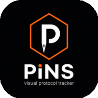

# Pins

**Peptide & Injection Protocol Tracker** — a local-first, privacy-focused visual protocol tracker for injection logging, inventory, scheduling, and body-map pin placement.



## Features

- **Visual body map** — log injections on front/back anatomical sites; pins color by recency (red &lt;24h, yellow &lt;7d, green older)
- **Injection logger** — compound, dose, site, notes with client-side validation
- **Inventory** — vial tracking with volume depletion, protocol frequency, and default dose
- **Schedule** — weekly dose calendar with ICS/text export
- **Recon calculator** — peptide reconstitution math
- **Dashboard** — streak, today's protocol, low-inventory alerts, recent pins
- **PWA** — installable home-screen app with manifest and app icons
- **Security** — AES-256-GCM encrypted local storage, optional passphrase lock, Zod input validation
- **Beta auth** — Supabase email/password + Google sign-in; minimal anonymous profile (age range + gender)

## Privacy

Health data (logs, inventory, schedule) stays **encrypted on your device** by default.

During beta signup, Pins stores only:
- Age range
- Gender

…for aggregate statistics. No personal health data is sent to servers unless you explicitly enable cloud backup (not yet available).

> We may collect anonymous usage data to improve the app. During signup we ask for age range and gender for statistical purposes only. No personal health data is ever sent to our servers unless you explicitly enable cloud backup.

## Tech Stack

- React 19 + TypeScript + Vite 6
- Tailwind CSS v4
- Wouter (routing)
- Web Crypto API (PBKDF2 + AES-GCM)
- Zod (validation)
- Supabase Auth (beta)
- Framer Motion

## Getting Started

### Prerequisites

- Node.js 20+ (LTS recommended)
- npm

### Install & run

```bash
git clone https://github.com/Kdpomaski/Pins-App.git
cd Pins-App
npm install
npm run dev
```

Open http://localhost:5173

### Environment variables

Copy `.env.example` to `.env` and fill in your Supabase credentials:

```env
VITE_SUPABASE_URL=https://your-project.supabase.co
VITE_SUPABASE_ANON_KEY=your-anon-key
```

### Supabase setup (beta auth)

1. Create a Supabase project at [supabase.com](https://supabase.com)
2. Run `supabase/schema.sql` in the SQL editor
3. Enable **Email** and **Google** providers under Authentication → Providers
4. Set **Site URL** to your app origin (e.g. `http://localhost:5173`)
5. Add redirect URL: `http://localhost:5173/auth/callback` (and production URL when deployed)

## Scripts

| Command | Description |
|---------|-------------|
| `npm run dev` | Start dev server |
| `npm run build` | Production build → `dist/` |
| `npm run preview` | Preview production build |
| `npm run typecheck` | TypeScript check |

## Project Structure

```
src/
  pages/          # Dashboard, BodyMap, Calendar, Inventory, Calculator, Auth
  components/     # Modals, nav, security UI
  lib/
    store.tsx     # Encrypted data store
    crypto.ts     # Web Crypto helpers
    storage.ts    # localStorage + migration
    schemas.ts    # Zod validation
    supabase.ts   # Supabase client
    auth-context.tsx
    sync.ts       # E2E sync envelope (future)
public/
  body-map/       # Front/back body images
  manifest.json   # PWA manifest
  icon-*.png      # App icons
supabase/
  schema.sql      # Profiles table + RLS
```

## Security

| Layer | Implementation |
|-------|----------------|
| At rest | AES-256-GCM via Web Crypto |
| Key derivation | PBKDF2, 310k iterations |
| Default mode | Device-bound encryption |
| Optional | Passphrase lock (re-encrypts on enable) |
| Validation | Zod schemas on all mutations |
| Telemetry | None — no analytics SDKs |
| CSP | Strict policy injected in production builds |

Legacy plaintext `pins_data` in localStorage is automatically migrated to encrypted `pins_secure_v1` on first load.

## PWA Install

The app includes `manifest.json` and Apple meta tags. On mobile:
- **iOS**: Safari → Share → Add to Home Screen
- **Android/Chrome**: Install app prompt or menu → Install

## License

Private beta — all rights reserved.

## Disclaimer

Pins is a personal organization tool. It does not provide medical advice. Always consult a qualified healthcare professional for medical decisions.